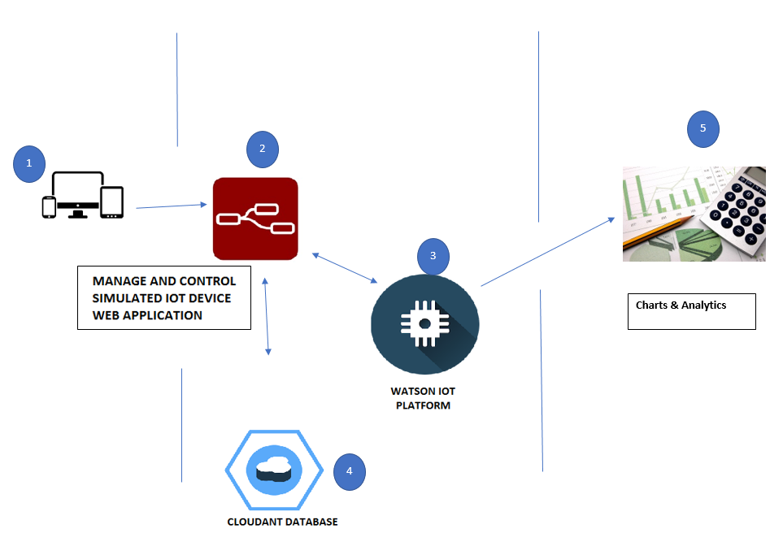
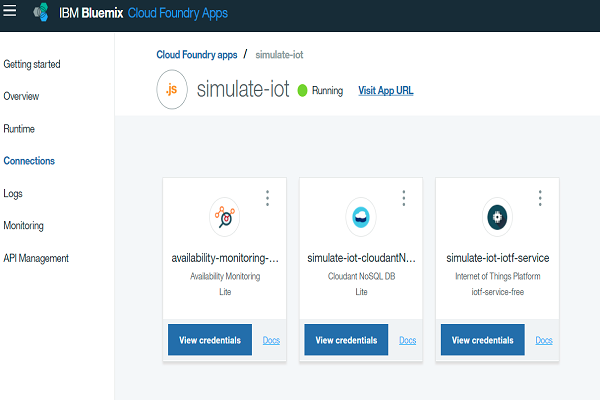
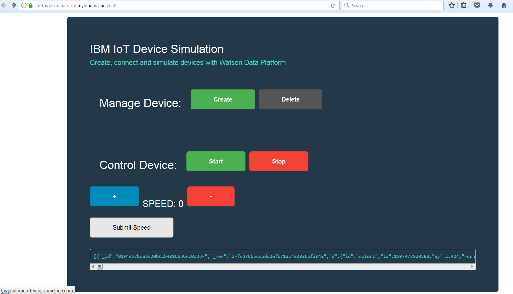
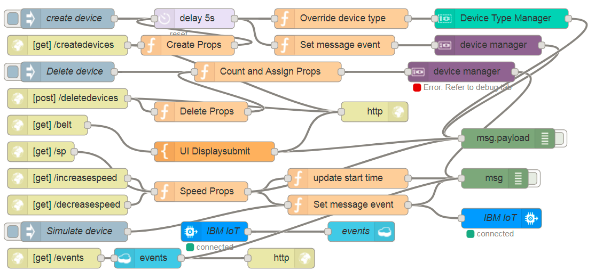

# Connecting a motor device as a simulated device
Build an IoT project with a simualted device that sends events for data monitoring on Watson IoT Platform on IBM Cloud.

## Overview and goal
This guide steps you through the process of connecting devices to Watson IoT Platform, monitoring and acting on device data.

We set up a connected simulated motor and use it to send IoT data to Watson IoT Platform.

The app self-registers a device with Watson IoT Platform and automatically sends well-formatted data to the platform.

As part of this guide, you will:
- Create and deploy a Watson IoT Platform organization by using Cloud Foundry CLI.
- Build and deploy the simulate-iot sample.
- Connect the simulated motor device to Watson IoT Platform.
- Monitor and visualize device data by using the Watson IoT Platform dashboards.

> To get started with Watson IoT Platform using a different IoT device, see the [Getting started tutorial](https://console.bluemix.net/docs/services/IoT/getting-started.html#getting-started-with-iotp).



Click here to view the [IBM Pattern](https://developer.ibm.com/code/patterns/develop-an-iot-app-with-node-red-and-watson/) for this project.

## Prerequisites
You will need the following accounts and tools:
* [IBM Cloud account](https://console.ng.bluemix.net/registration/)
* [Bluemix CLI](https://console.bluemix.net/docs/cli/reference/bluemix_cli/index.html#getting-started)
* Optional: [Git](https://git-scm.com/downloads)
If you choose to use Git to download the code samples you must also have a [GitHub.com account](https://github.com). You can also download the code as a compressed file without a GitHub.com account.

## Deploy to IBM Cloud
If you want to deploy directly to IBM Cloud, click on 'Deploy to IBM Cloud' button below to create a IBM Cloud DevOps service toolchain and pipeline for deploying basic motor with an IoT device that sends monitoring data to Watson IoT Platform on IBM Cloud, else jump to [Steps](#steps)

[](https://console.ng.bluemix.net/devops/setup/deploy/?repository=https://github.com/IBM/manage-control-device-node-red)

After deploying the application, please continue with [Step 3 - See raw data in Watson IoT Platform](#step-3---see-raw-data-in-watson-iot-platform).

> You can also create a Node-Red app manually from IBM Cloud Catalog.
## Steps
* [Deploy Watson IoT Platform](#step-1----deploy-watson-iot-platform)
* Do one of the following 2 steps:

   - [Deploy the sample simulate-iot web application](#step-2---deploy-the-sample-simulate-iot-web-application)

* [See raw data in Watson IoT Platform](#step-3---see-raw-data-in-watson-iot-platform)
* [Visualize live data in Watson IoT Platform](#step-4---visualize-live-data-in-watson-iot-platform)

## Step 1 -  Deploy Watson IoT Platform

> Watson IoT Platform provides powerful application access to IoT devices and data to help you rapidly compose analytics applications, visualization dashboards, and mobile IoT apps. The steps that follow will deploy an instance of the Watson IoT Platform service with the name `simulate-iot` in your IBM Cloud environment. If you already have a service instance running, you can use that instance with the guide and skip this first step. Just make sure that you use the correct service name and IBM Cloud space when you proceed through the guides.

1. From the command line, set your API endpoint by running the cf api command.   
Replace the `API-ENDPOINT` value with the API endpoint for your region.
```
cf api <API-ENDPOINT>
```
Example: `cf api https://api.ng.bluemix.net`
<table>
<tr>
<th>Region</th>
<th>API Endpoint</th>
</tr>
<tr>
<td>US South</td>
<td>https://api.ng.bluemix.net</td>
</tr>
<tr>
<td>United Kingdom</td>
<td>https://api.eu-gb.bluemix.net</td>
</tr>
</table>

2. Log into your IBM Cloud account.
```
cf login -u YOUR_BLUEMIX_USERNAME
```
If prompted, select the organization and space where you want to deploy Watson IoT Platform and the sample app. **Note** example a) org: john.doe@ibm.com  b) space = dev

3. Deploy the Watson IoT Platform service to IBM Cloud.
```    
cf create-service iotf-service iotf-service-free YOUR_IOT_PLATFORM_NAME
```

For YOUR_IOT_PLATFORM_NAME, use *simulate-iot*.  
Example: `cf create-service iotf-service iotf-service-free simulate-iot`

## Step 2 - Deploy the sample simulate IoT web application  

The sample app lets you simulate a IBM Cloud connected industrial devices.

You can start and stop the motor and adjust the speed of the motor. Every change to the motor is sent to IBM Cloud in the form of an MQTT message that is displayed in the app. You can monitor the motor behavior by using the default dashboard cards.

This sample is using a motor which is a simulated device and can be replaced with any device to perform the same behavior.



**To deploy this setup from a terminal instead, you can use the following commands:**
```
cf api api.ng.bluemix.net
cf login -u YOUR_BLUEMIX_USERNAME
cf create-service iotf-service iotf-service-free simulate-iot
cf push simulate-iot --no-start
cf bind-service simulate-iot
cf restage simulate-iot
cf start simulate-iot
```
> To troubleshoot errors, use `cf logs YOUR_APP_NAME --recent` command (i.e. `cf logs simulate-iot --recent`).

* In a browser, access the app.  
Open the following URL: `https://YOUR_APP_NAME.mybluemix.net`    
Example: `https://simulate-iot.mybluemix.net/`.

```
Copy from flow folder the content of flow.txt into `https://simulate-iot.mybluemix.net/red` after you setup an username/password. Paste it under the Menu tab -> Import -> Clipboard and press Import. Now ready for `https://YOUR_APP_NAME.mybluemix.net/motor`
```
[Live Demo](https://simulate-iot.mybluemix.net/motor)



* For more information about registering devices, see [Connecting devices](https://console.bluemix.net/docs/services/IoT/iotplatform_task.html#iotplatform_subtask1).
4. Continue with [Step 3 - See raw data in Watson IoT Platform](#step-3---see-raw-data-in-watson-iot-platform).

## Step 3 - See raw data in Watson IoT Platform

1. Verify that the device is registered with Watson IoT Platform.
    * Login to your IBM Cloud dashboard at:  [https://bluemix.net](https://bluemix.net/)
    * From [your list of services](https://bluemix.net/dashboard/services), click the *simulate-iot-iotf-service* Watson IoT Platform} service.
    * Click *Launch* to open the Watson IoT Platform dashboard in a new browser tab.  
        You can bookmark the URL for easy access later.   
        Example: `https://*iot-org-id*.internetofthings.ibmcloud.com`.
    * From the menu, select **Devices** and verify that your new device is displayed.

2. View raw data
    * From the menu, select **Boards**.
    * Select the **Device Centric Analytics** board.
    * Locate the **Devices I Care About** card and select your device.  
        The device name is displayed in the Device Properties card.

3. Send sensor data to the platform.   
The device sends data to Watson IoT Platform when sensor readings change. You can simulate this data sending by stopping, starting or changing the speed of the motor.

4. Verify that the updated device data points that correspond to the published message are displayed in the Device Properties card.  
Message example A:
  ```
{
    "d":{
      "id":"motor1",
      "ts":1507477920588,
      "ay":1.424,
      "running":true,
      "rpm":1.5,
      "speed":"1",
      "timestamp":"Sun, 08 Oct 2017 15:52:00 GMT",
      "msgCount":1
    }
}
  ```

## Step 4 - Visualize live data in Watson IoT Platform

To create a dashboard card to see live motor device data:
1. On the same Device Centric Analytics board, click **Add New Card** and then select **Line Chart**.
2. For card source data, click **Cards**.   
A list of card names is displayed.
3. Select **Devices I Care About** and then click **Next**.
4. Click **Connect new data set** and enter the following values for the data set parameters:
      - Event: eventData
      - Property: speed
      - Name: Motor Speed
      - Type: Number
      - Unit: rpm
5. Click **Next**.
6. On the card preview page, select **L**, and then click **Next**.
7. On the card information page, change the name of the title to `Motor data` and then click **Submit**.
8. Change the speed of your motor to see live data in your new card.
9. Optional: Add a second data set to add acceleration data for the motor.
  

For more information about creating boards and cards, see [Visualizing real-time data by using boards and cards](https://console.bluemix.net/docs/services/IoT/data_visualization.html#boards_and_cards).

[](https://simulate-iot.mybluemix.net/motor)  [](https://youtu.be/TufD9akAaXY)

## Useful links

* [IBM Cloud](https://bluemix.net/)  
* [IBM Cloud Documentation](https://www.ng.bluemix.net/docs/)  
* [IBM Cloud Developers Community](http://developer.ibm.com/bluemix)  
* [IBM Watson Internet of Things](http://www.ibm.com/internet-of-things/)  
* [IBM Watson IoT Platform](http://www.ibm.com/internet-of-things/iot-solutions/watson-iot-platform/)   
* [IBM Watson IoT Platform Developers Community](https://developer.ibm.com/iotplatform/)

## Privacy Notice

Sample web applications that include this package may be configured to track deployments to [IBM Cloud](https://www.bluemix.net/) and other Cloud Foundry platforms. The following information is sent to a [Deployment Tracker](https://github.com/IBM/metrics-collector-service) service on each deployment:

* Node.js package version
* Node.js repository URL
* Application Name (`application_name`)
* Application GUID (`application_id`)
* Application instance index number (`instance_index`)
* Space ID (`space_id`) or OS username
* Application Version (`application_version`)
* Application URIs (`application_uris`)
* Cloud Foundry API (`cf_api`)
* Labels and names of bound services
* Number of instances for each bound service and associated plan information
* Metadata in the repository.yaml file

This data is collected from the `package.json` and `repository.yaml` file in the sample application and the `VCAP_APPLICATION` and `VCAP_SERVICES` environment variables in IBM Cloud and other Cloud Foundry platforms. This data is used by IBM to track metrics around deployments of sample applications to IBM Cloud to measure the usefulness of our examples, so that we can continuously improve the content we offer to you. Only deployments of sample applications that include code to ping the Deployment Tracker service will be tracked.

## Disabling deployment tracking
Deployment tracking can be disabled by removing the `require("metrics-tracker-client").track();` line from the 'index.js' file.

## License
[Apache 2.0](LICENSE)
