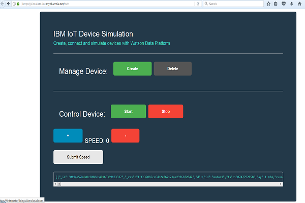
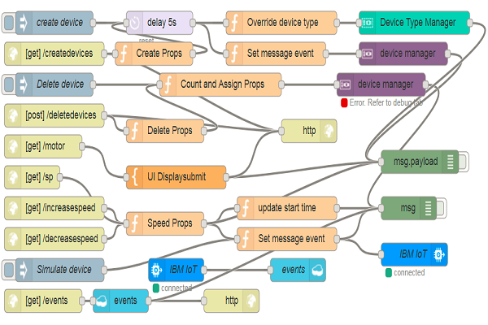

# WARNING: This repository is no longer maintained :warning:

> This repository will not be updated. The repository will be kept available in read-only mode.


**__Skill Level__**: Any Skill Level
<br>**__N.B__**: All services used in this repo are Lite plans.


# [Connecting a motor device as a simulated device](https://developer.ibm.com/code/patterns/develop-an-iot-app-with-node-red-and-watson/)
Build an IoT project with a simualted device that sends events for data monitoring on Watson IoT Platform on IBM Cloud.

## Overview and goal
This guide steps you through the process of connecting devices to Watson IoT Platform, monitoring and acting on device data.

__The outcome of this project will help you:__
1. manage and control simulated devices
2. control their speed
3. understand and hands-on the IoT Platform
4. Save and make use of this data with Cloudant
5. Explore different ways on how to visualize your data
6. Explore different ways to build an UI with node-red

We set up a connected simulated motor and use it to send IoT data to Watson IoT Platform.

The app self-registers a device with Watson IoT Platform and automatically sends well-formatted data to the platform.

As part of this guide, you will:
- Create and deploy a Watson IoT Platform organization by using Cloud Foundry CLI.
- Build and deploy the simulate-iot sample.
- Connect the simulated motor device to Watson IoT Platform.
- Monitor and visualize device data by using the Watson IoT Platform dashboards.

> To get started with Watson IoT Platform using a different IoT device, see the [Getting started tutorial](https://console.bluemix.net/docs/services/IoT/getting-started.html#getting-started-with-iotp).


Click here to view the [IBM Pattern](https://developer.ibm.com/code/patterns/develop-an-iot-app-with-node-red-and-watson/) for this project.

## Prerequisites
You will need the following accounts and tools:
* [IBM Cloud account](https://console.ng.bluemix.net/registration/)
* [Bluemix CLI](https://console.bluemix.net/docs/cli/reference/ibmcloud/bx_cli.html#ibmcloud_cli)
* Optional: [Git](https://git-scm.com/downloads)
If you choose to use Git to download the code samples you must also have a [GitHub.com account](https://github.com). You can also download the code as a compressed file without a GitHub.com account.

<hr>

## Steps
1) [Deploy Watson IoT Platform](#step-1----deploy-watson-iot-platform)
2) [Deploy the node-red simulate iot app (make sure you rename your app)](#step-2---deploy-the-sample-simulate-iot-web-application)
3) [Store data in Cloudant database](#step-3---cloudant-will-be-part-of-this-setup)
4) [See raw data in Watson IoT Platform](#step-4---see-raw-data-in-watson-iot-platform)
5) [Visualize live data in Watson IoT Platform](#step-5---visualize-live-data-in-watson-iot-platform)

<hr>

## Step 1 -  Deploy Watson IoT Platform

Watson IoT Platform provides powerful application access to IoT devices and data to help you rapidly compose analytics applications, visualization dashboards, and mobile IoT apps. The steps that follow will deploy an instance of the Watson IoT Platform service with the name `simulate-iot` in your IBM Cloud environment. If you already have a service instance running, you can use that instance with the guide and skip this first step. Just make sure that you use the correct service name and IBM Cloud space when you proceed through the guides.

[Create a Node-Red boilerplate](steps/nodered.md) from IBM Cloud Catalog that will include Node-RED editor, Cloudant database and Watson IoT Platform service. Follow the steps and make sure to import the scripts into your Node-RED editor.

<hr>

## Step 2 - Deploy the sample simulate IoT web application  

The sample app lets you simulate a IBM Cloud connected industrial devices.

You can start and stop the motor and adjust the speed of the motor. Every change to the motor is sent to IBM Cloud in the form of an MQTT message that is displayed in the app. You can monitor the motor behavior by using the default dashboard cards.

This sample is using a motor which is a simulated device and can be replaced with any device to perform the same behavior.



* In a browser, access the app.  
Open the following URL: `https://YOUR_APP_NAME.mybluemix.net`    
Example: `https://simulate-iot.mybluemix.net/`.


__Make sure that the following instructions have been addressed in `Step 1`:__

* Copy from flow folder the content of flow.txt into `https://simulate-iot.mybluemix.net/red` after you setup an username/password.
* Paste it under the `Menu tab -> Import -> Clipboard` and press `Import`.
* Now ready for `https://YOUR_APP_NAME.mybluemix.net/motor`


<hr>

> ## Step 3 - Cloudant database will be part of this step 2 setup

[Live Demo](https://avoda.mybluemix.net/belt)



* Make sure to change `https://simulate-iot.mybluemix.net/` to `<YOUR_APP_NAME>.mybluemix.net/` in `UI Displaysubmit` node.

* UI is accessible at `<YOUR_APP_NAME>.mybluemix.net/motor` or `<YOUR_APP_NAME>.mybluemix.net/belt`

* For more information about registering devices, see [Connecting devices](https://console.bluemix.net/docs/services/IoT/iotplatform_task.html#iotplatform_subtask1).
4. Continue with [Step 4 - See raw data in Watson IoT Platform](#step-4---see-raw-data-in-watson-iot-platform).

> [How to create an API key and token in Watson IoT Platform](https://developer.ibm.com/code/howtos/iot-generate-apikey-apitoken)

<hr>

## Step 4 - See raw data in Watson IoT Platform

1. Verify that the device is registered with Watson IoT Platform.
    * Login to your IBM Cloud dashboard at:  [https://bluemix.net](https://bluemix.net/)
    * From [your list of services](https://bluemix.net/dashboard/services), click the *simulate-iot-iotf-service* Watson IoT Platform} service.
    * Click *Launch* to open the Watson IoT Platform dashboard in a new browser tab.  
        You can bookmark the URL for easy access later.   
        Example: `https://<ORG_ID>.internetofthings.ibmcloud.com`.
    * From the menu, select **Devices** and verify that your new device is displayed.

2. View raw data
    * From the menu, select **Boards**.
    * Select the **Device Centric Analytics** board.
    * Locate the **Devices I Care About** card and select your device.  
        The device name is displayed in the Device Properties card.

3. Send sensor data to the platform.   
The device sends data to Watson IoT Platform when sensor readings change. You can simulate this data sending by stopping, starting or changing the speed of the motor.

4. Verify that the updated device data points that correspond to the published message are displayed in the Device Properties card.  
Message example A:
  ```
{
    "d":{
      "id":"motor1",
      "ts":1507477920588,
      "ay":1.424,
      "running":true,
      "rpm":1.5,
      "speed":"1",
      "timestamp":"Sun, 08 Oct 2017 15:52:00 GMT",
      "msgCount":1
    }
}
  ```

<hr>

## Step 5 - Visualize live data in Watson IoT Platform

To create a dashboard card to see live motor device data:
1. On the same Device Centric Analytics board, click **Add New Card** and then select **Line Chart**.
2. For card source data, click **Cards**.   
A list of card names is displayed.
3. Select **Devices I Care About** and then click **Next**.
4. Click **Connect new data set** and enter the following values for the data set parameters:
      - Event: eventData
      - Property: speed
      - Name: Motor Speed
      - Type: Number
      - Unit: rpm
5. Click **Next**.
6. On the card preview page, select **L**, and then click **Next**.
7. On the card information page, change the name of the title to `Motor data` and then click **Submit**.
8. Change the speed of your motor to see live data in your new card.
9. Optional: Add a second data set to add acceleration data for the motor.
  

<hr>

For more information about creating boards and cards, see [Visualizing real-time data by using boards and cards](https://console.bluemix.net/docs/services/IoT/data_visualization.html#boards_and_cards).

[](https://simulate-iot.mybluemix.net/motor)  [](https://youtu.be/TufD9akAaXY)

## Useful links

* [IBM Cloud](https://bluemix.net/)  
* [IBM Cloud Documentation](https://www.ng.bluemix.net/docs/)  
* [IBM Cloud Developers Community](http://developer.ibm.com/bluemix)  
* [IBM Watson Internet of Things](http://www.ibm.com/internet-of-things/)  
* [IBM Watson IoT Platform](http://www.ibm.com/internet-of-things/iot-solutions/watson-iot-platform/)   
* [IBM Watson IoT Platform Developers Community](https://developer.ibm.com/iotplatform/)


## <h2>Learn more</h2>
<ul>
<li><strong>Artificial Intelligence Code Patterns</strong>: Enjoyed this Code Pattern? Check out our other <a href="https://developer.ibm.com/code/technologies/artificial-intelligence/" rel="nofollow">AI Code Patterns</a>.</li>
<li><strong>Data Analytics Code Patterns</strong>: Enjoyed this Code Pattern? Check out our other <a href="https://developer.ibm.com/code/technologies/data-science/" rel="nofollow">Data Analytics Code Patterns</a></li>
<li><strong>AI and Data Code Pattern Playlist</strong>: Bookmark our <a href="https://www.youtube.com/playlist?list=PLzUbsvIyrNfknNewObx5N7uGZ5FKH0Fde" rel="nofollow">playlist</a> with all of our Code Pattern videos</li>
<li><strong>With Watson</strong>: Want to take your Watson app to the next level? Looking to utilize Watson Brand assets? <a href="https://www.ibm.com/watson/with-watson/" rel="nofollow">Join the With Watson program</a> to leverage exclusive brand, marketing, and tech resources to amplify and accelerate your Watson embedded commercial solution.</li>
<li><strong>Watson Studios</strong>: Master the art of data science with IBM's <a href="https://datascience.ibm.com/" rel="nofollow">Watson Studios</a></li>
<li><strong>PowerAI</strong>: Get started or get scaling, faster, with a software distribution for machine learning running on the Enterprise Platform for AI: <a href="https://www.ibm.com/ms-en/marketplace/deep-learning-platform" rel="nofollow">IBM Power Systems</a></li>
<li><strong>Spark on IBM Cloud</strong>: Need a Spark cluster? Create up to 30 Spark executors on IBM Cloud with our <a href="https://console.bluemix.net/catalog/services/apache-spark" rel="nofollow">Spark service</a></li>
<li><strong>Kubernetes on IBM Cloud</strong>: Deliver your apps with the combined the power of <a href="https://www.ibm.com/cloud-computing/bluemix/containers" rel="nofollow">Kubernetes and Docker on IBM Cloud</a></li>
</ul>

## License
This code pattern is licensed under the Apache Software License, Version 2.  Separate third party code objects invoked within this code pattern are licensed by their respective providers pursuant to their own separate licenses. Contributions are subject to the [Developer Certificate of Origin, Version 1.1 (DCO)](https://developercertificate.org/) and the [Apache Software License, Version 2](http://www.apache.org/licenses/LICENSE-2.0.txt).

[Apache Software License (ASL) FAQ](http://www.apache.org/foundation/license-faq.html#WhatDoesItMEAN)
